# NoirGlass

NoirGlass gives Jellyfin's browser interface, Jellyfin Web, a cinematic, Apple TV-inspired appearance: large artwork, spacious browsing, and translucent controls. Install the CSS theme for the new look, then add the optional server plugin if you want extra features.

- **Theme:** styles media pages, menus, user Settings, and native playback controls.
- **Plugin:** adds a featured Home carousel—a rotating display of titles from each user's accessible library.
- **Plugin:** adds source-format badges and applies the theme to the administrator Dashboard.

## Requirements

Tested on Jellyfin 12.1. Use Jellyfin Web with the **Dark** theme and **Desktop (Legacy)** or **Mobile (Legacy)** display mode. These settings are under **Settings → Display**.

## Install the theme

1. Back up your existing Custom CSS and remove other full-theme imports.
2. Choose one installation location: **Dashboard → Branding → Custom CSS** for everyone (administrator required), or **Settings → Display → Custom CSS** for your account.
3. Paste this line, save, and refresh Jellyfin Web:

```css
@import url("https://cdn.jsdelivr.net/gh/iammarxg/NoirGlass@latest/dist/noirglass.min.css");
```

The import loads the theme, fonts, and icons. The CSS theme works without the plugin.

## Add the optional plugin

An administrator can add this catalog URL under **Dashboard → Plugins → Catalog → Repositories**:

```text
https://github.com/iammarxg/NoirGlass/releases/latest/download/manifest.json
```

Install **NoirGlass** from the catalog and **restart Jellyfin**. Keep the CSS import installed.

Open **Dashboard → Plugins → NoirGlass** to configure featured titles, autoplay, library links, and branding. Defaults are **10 titles**, **10-second slide changes**, and **six-hour lineup refreshes**. See the [setup guide](docs/SETUP.md) for steps and troubleshooting.

Format badges describe the source file and selected tracks; they do not guarantee the browser's playback quality.

## Customize

A CSS variable is a named setting for colors, spacing, or sizing. Add your overrides after the import in the same field:

```css
:root {
  --ng-card-gap: 32px;
  --ng-glass-opacity-scale: .8;
}
```

This adds more space between shelf cards and makes glass backgrounds more transparent. Explore the [customization guide](docs/CUSTOMIZATION.md) for three presets and all settings.

## Remove

Delete the import and your NoirGlass overrides, save, and refresh. If installed, uninstall the plugin and restart Jellyfin. Your media and metadata are unaffected.

<details>
<summary>Screenshots</summary>

Desktop and mobile previews from a Jellyfin library.

| View | Desktop | Mobile |
| --- | --- | --- |
| Home | 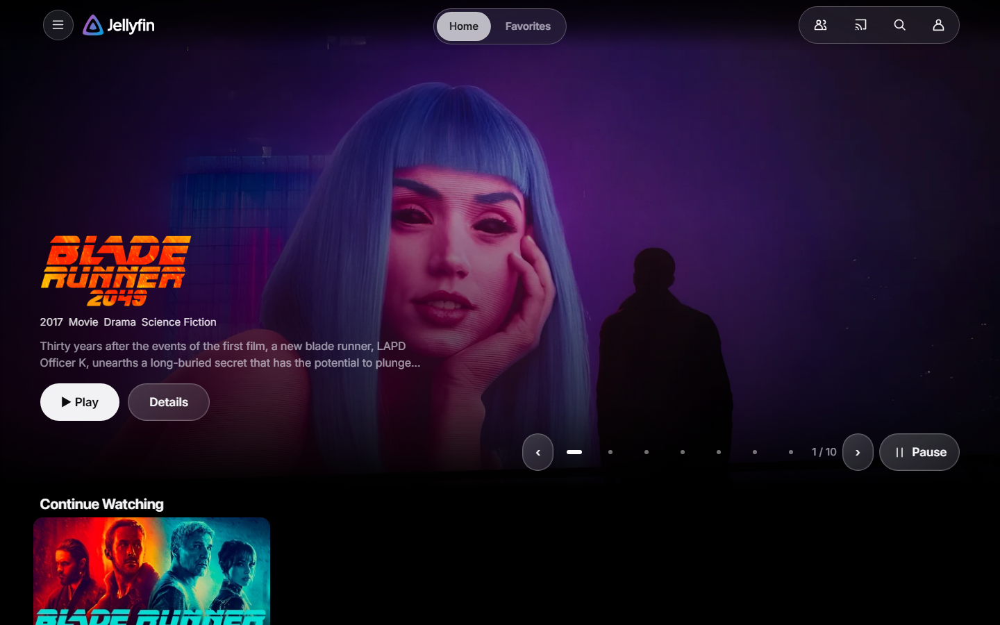 | 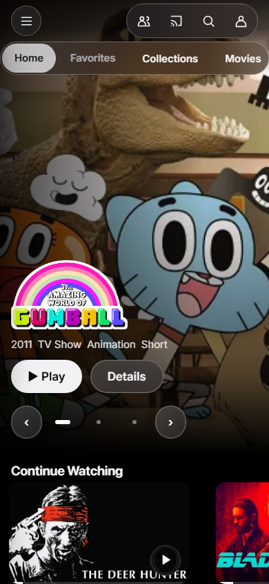 |
| Navigation | 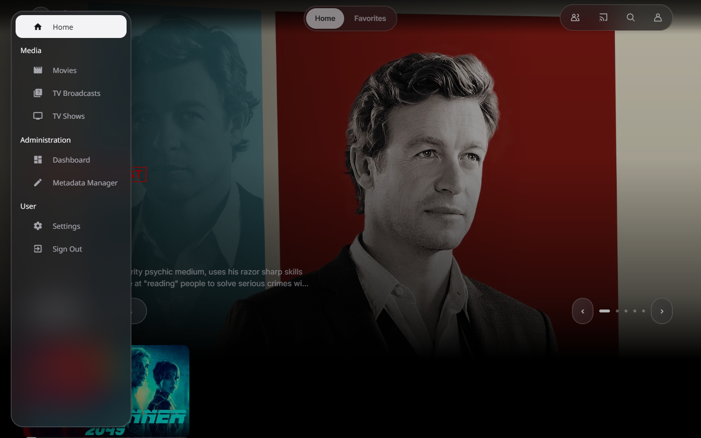 | 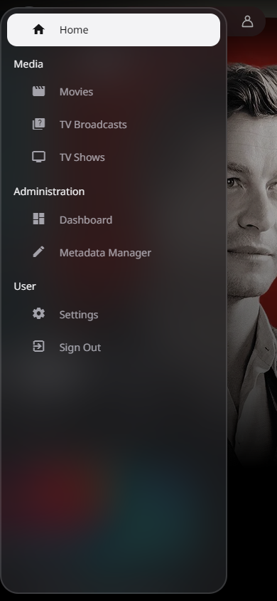 |
| Details | 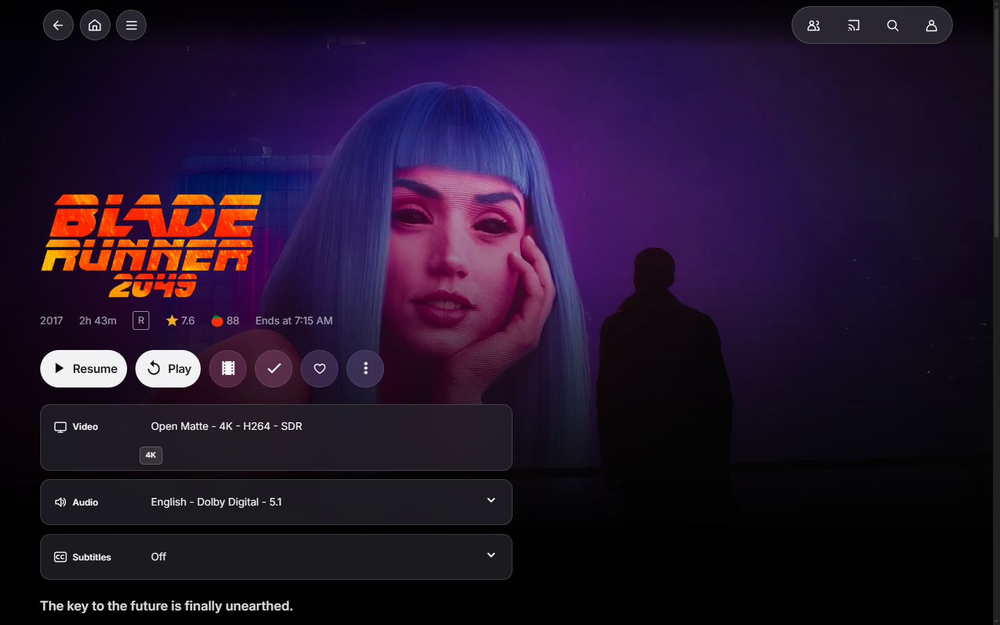 | 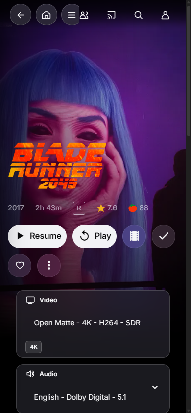 |
| Library | 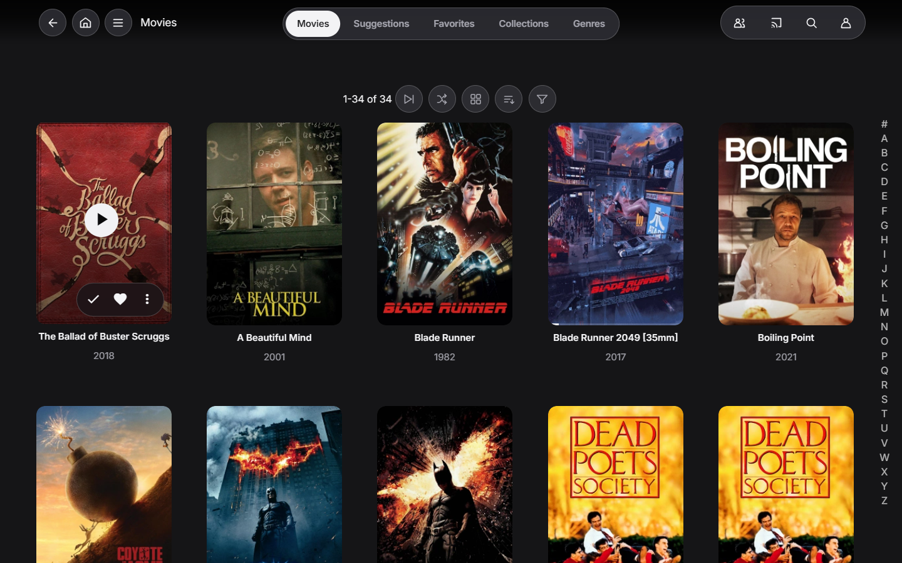 | 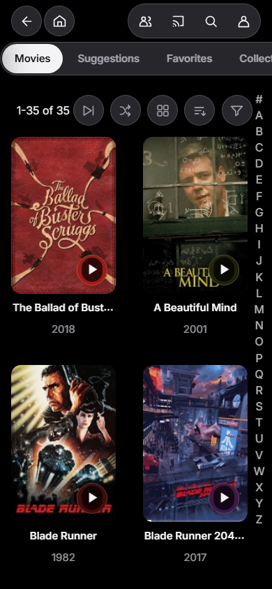 |
| Search | 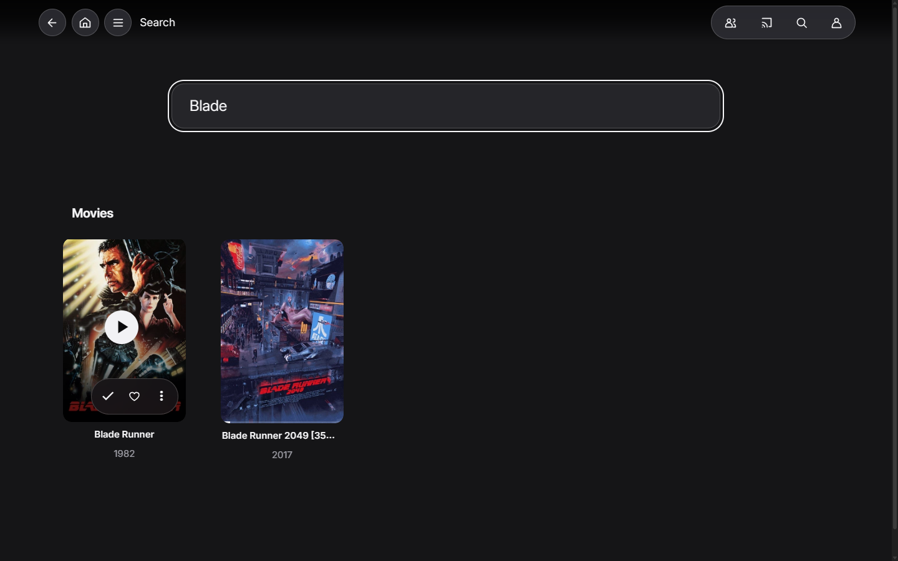 | 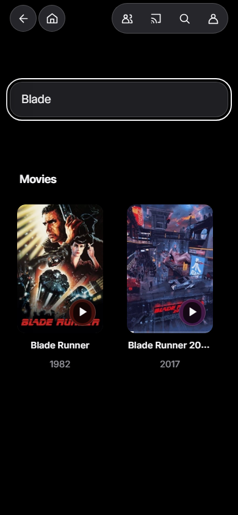 |
| Episodes | 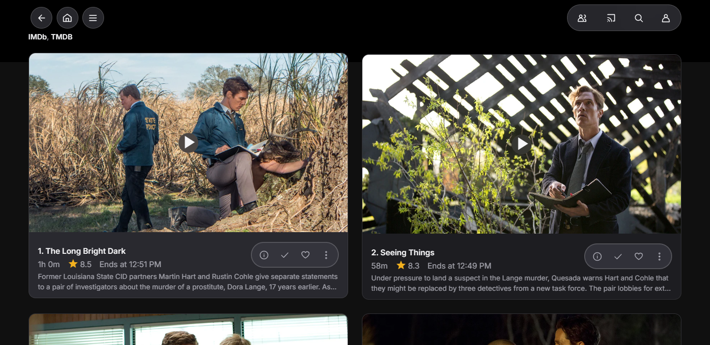 | 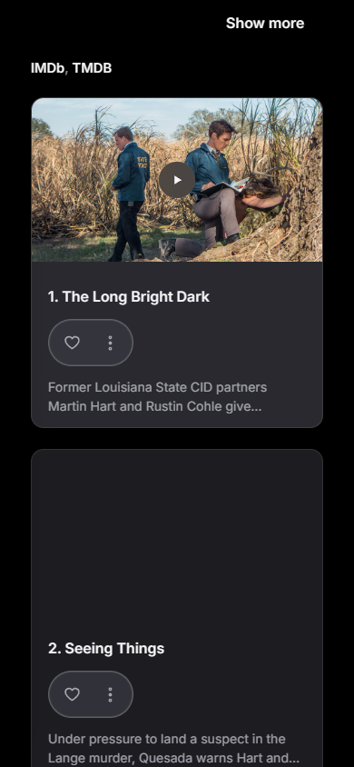 |
| Player | 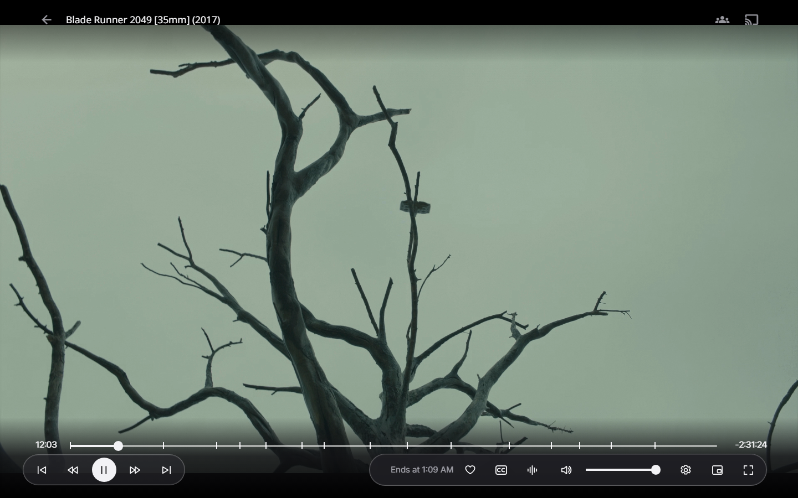 | 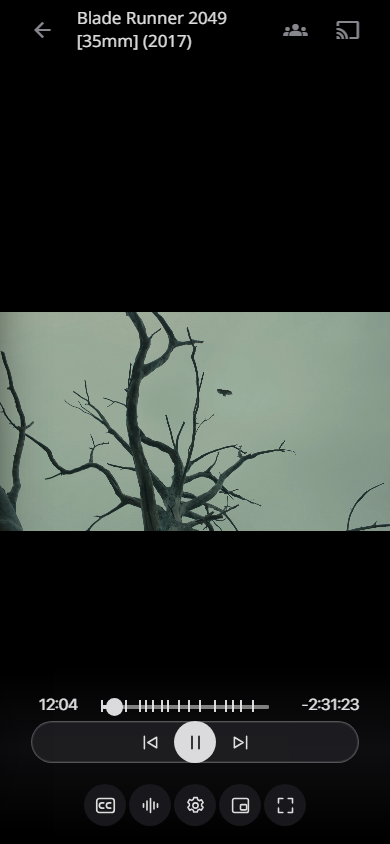 |
| Login | 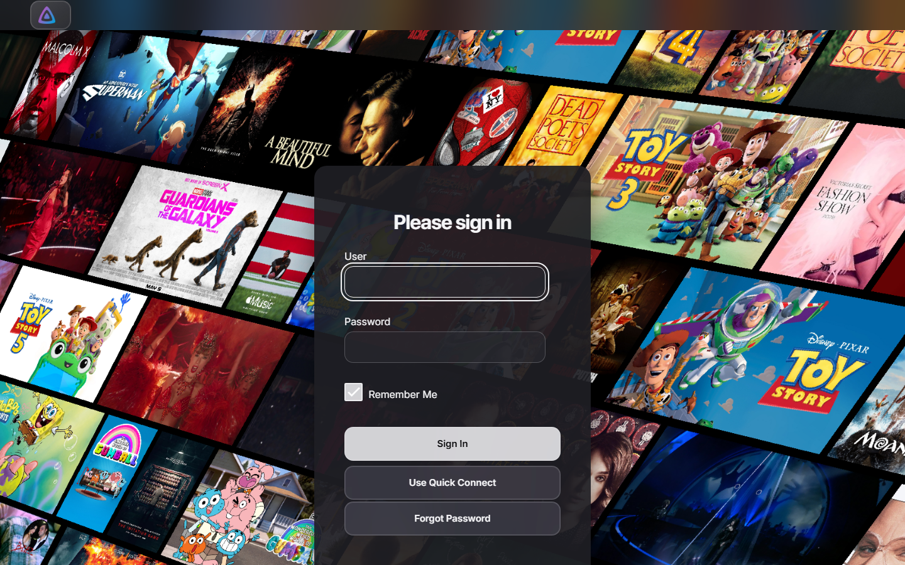 | 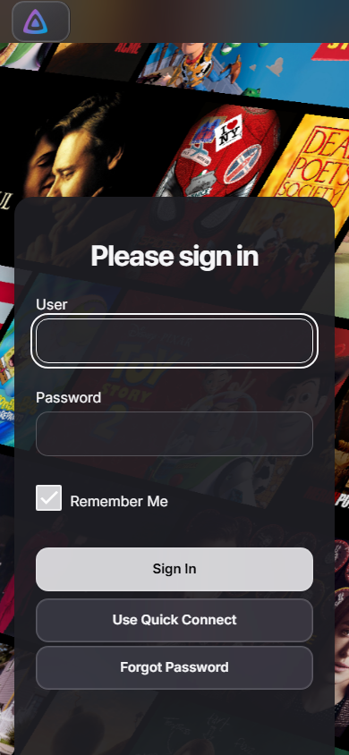 |

</details>

## More information

- [Setup and troubleshooting](docs/SETUP.md)
- [Release changelog](CHANGELOG.md)
- [Contributing and development](docs/DEVELOPMENT.md)

## License

[MIT](LICENSE) © Ammar Alghamdi. Bundled Inter uses the [SIL Open Font License](assets/fonts/OFL.txt); see [font provenance](assets/fonts/PROVENANCE.md). Inspired by Apple TV, with no affiliation or endorsement by Apple, Dolby, or Jellyfin. No proprietary artwork, logos, or fonts are bundled.
